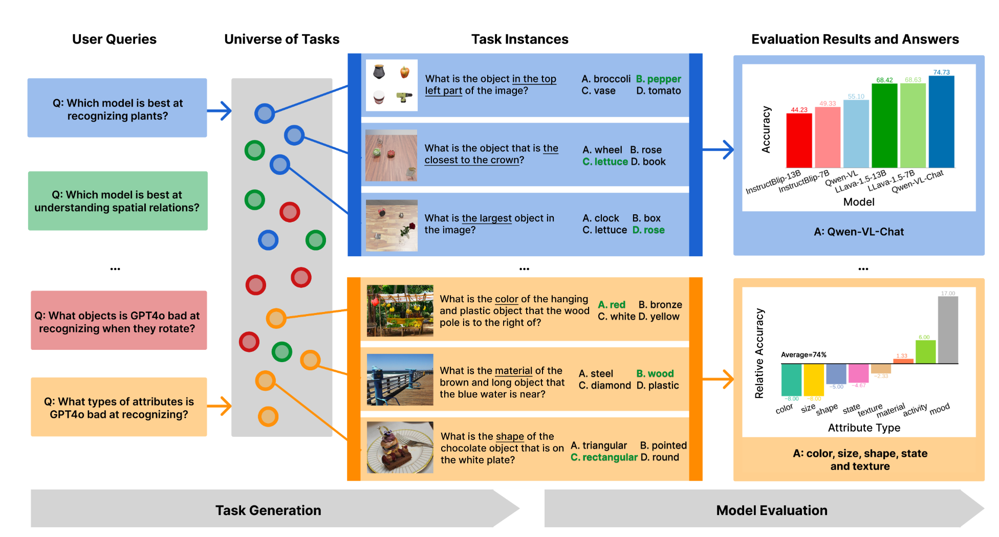

Hi, I am a 2nd-year undergrad at the University of Washington, Seattle, advised by Prof. [Ranjay Krishna](http://www.ranjaykrishna.com/index.html), PhD student [Jieyu Zhang](https://jieyuz2.github.io/), and PhD student [Zixian Ma](https://zixianma.github.io/) at [UW CSE RAIVN Lab](https://raivn.cs.washington.edu/).

**Research Interests**:
I am interested in applying **data-centric** and **learning-based** methods to create generalized and robust foundation models for 2D/3D detection and segmentation, LLM/VLM, embodied AI, image/video editing and generation.

<!-- I am looking for co-first or leading-author-level collaborators for projects over the coming years. If you are interested, please feel free to reach out. -->

## 📝 Selected Publications
(* denotes equal contribution)

### Preprints

  
  

    <strong><a href="https://github.com/weikaih04/SOS">SOS: Synthetic Object Segments Improve Detection, Segmentation, and Grounding</a></strong> 
    <strong>Weikai Huang</strong>, Jieyu Zhang, Taoyang Jia, Chenhao Zheng, Ziqi Gao, Jae Sung Park, Ranjay Krishna
  

### Peer-reviewed

  
  

    <strong><a href="https://generate-any-scene.github.io/">Generate Any Scene: Evaluating and Improving Text-to-Vision Generation with Scene Graph Programming</a></strong> 
    Ziqi Gao*, <strong>Weikai Huang*</strong>, Jieyu Zhang, Aniruddha Kembhavi, Ranjay Krishna
    <em>SynData4CV @ CVPR 2025</em>
  

  
  

    <strong><a href="http://arxiv.org/abs/2412.07012">ProVision: Programmatically Scaling Vision-centric Instruction Data for Multimodal Language Models</a></strong> 
    Jieyu Zhang, Le Xue, Linxin Song, Jun Wang, <strong>Weikai Huang</strong>, Manli Shu, An Yan, Zixian Ma, Juan Carlos Niebles, Silvio Savarese, Caiming Xiong, Zeyuan Chen, Ranjay Krishna, Ran Xu. 
    <a href="https://www.salesforce.com/blog/provision-multimodal-data-generation/" style="color: red;">Blog at Salesforce Research</a> | 
    <a href="https://venturebeat.com/data-infrastructure/breaking-the-data-bottleneck-salesforces-provision-speeds-multimodal-ai-training-with-image-scene-graphs/" style="color: red;">VentureBeat</a> | 
    <a href="https://www.marktechpost.com/2025/01/11/provision-a-scalable-programmatic-approach-to-vision-centric-instruction-data-for-multimodal-language-models/" style="color: red;">MarkTechPost</a> 
    <em>SynthData @ ICLR 2025</em>
  

  
  

    <strong><a href="https://www.task-me-anything.org/">Task Me Anything</a></strong> 
    Jieyu Zhang, <strong>Weikai Huang*</strong>, Zixian Ma*, Oscar Michel, Dong He, Tanmay Gupta, Wei-Chiu Ma, Ali Farhadi, Aniruddha Kembhavi, Ranjay Krishna. 
    <ins><em>NeurIPS 2024</em></ins> (Main Conference) | <ins><em>Video-Language Models @ NeurIPS 2024</em></ins> Oral Presentation 
    <a href="https://snorkel.ai/blog/task-me-anything-innovating-multimodal-model-benchmarks/" style="color: red;">Blog at Snorkel AI</a> | 
    <a href="https://www.youtube.com/watch?v=J3ECnV8Yc_g" style="color: red;">Talk at Snorkel AI</a>
  

  
  

    <strong><a href="https://arxiv.org/abs/2403.11085">m&m's: A Benchmark to Evaluate Tool-Use for multi-step multi-modal Tasks</a></strong> 
    Zixian Ma, <strong>Weikai Huang</strong>, Jieyu Zhang, Tanmay Gupta, Ranjay Krishna 
    <em>ECCV 2024</em>
  

## 🎓 Education
- **University of Washington**  
  *B.S. in Computer Science, Minor in Applied Mathematics and Music*  
  2023 – 2027 (Expected)
  
## 📰 News
- [2024-9] Our work [Task Me Anything](https://www.task-me-anything.org/) is accepted to NeurIPS 2024.
- [2024-7] Our work [m&m's: A Benchmark to Evaluate Tool-Use for multi-step multi-modal Tasks](https://arxiv.org/abs/2403.11085) is accepted to ECCV 2024.
  
## 🏅 Awards
- UW CSE John and JoAnne Wisniewski Endowed Scholarship 2024

## 📍 Professional Services
- Organizer of the **Synthetic Data for Computer Vision Workshop** at CVPR 2024 and CVPR 2025 ([website](https://syndata4cv.github.io/))
- TA for **UW CSE 493G: Deep Learning**, Spring 2025 ([course page](https://courses.cs.washington.edu/courses/cse493g1/25sp/))

## 📫 Contact
Email: weikaih@cs.washington.edu
 Twitter (X): [@weikaih04](https://twitter.com/weikaih04)
 Instagram: [@weikaih04](https://www.instagram.com/weikaih04/)
 Linkedin: [Weikai Huang](https://www.linkedin.com/in/weikaihuang/)
 Wechat: hwk18105962347 