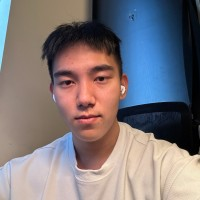

  

    <h1>Weikai Huang</h1>
    
Undergrad @ UW CSE RAIVN Lab

    
I am an undergraduate student at the University of Washington, advised by Prof. <a href="http://www.ranjaykrishna.com/index.html">Ranjay Krishna</a>, PhD student <a href="https://jieyuz2.github.io/">Jieyu Zhang</a>, and PhD student <a href="https://zixianma.github.io/">Zixian Ma</a> at <a href="https://raivn.cs.washington.edu/">UW CSE RAIVN Lab</a>. I am also a student researcher at <a href="https://allenai.org/">Allen Institute for AI</a>.

    
I work on computer vision, with a particular interest in <strong>2D/3D/4D detection, tracking, reconstruction, and generation in the wild</strong>, vision-language models, and spatial understanding for embodied AI.

    
<a href="mailto:weikaih@cs.washington.edu">Email</a> / <a href="https://github.com/weikaih04" target="_blank">GitHub</a> / <a href="https://scholar.google.com/citations?user=myeLQPEAAAAJ&hl=en&authuser=1" target="_blank">Google Scholar</a> / <a href="https://twitter.com/weikaih04" target="_blank">X (Twitter)</a> / <a href="/files/weikai_cv.pdf" target="_blank">CV</a>

  

  

    
  

  📢 I'm applying for PhD programs in the 2027 cycle. Feel free to <a href="mailto:weikaih@cs.washington.edu">reach out</a>!

## News
- **[2026-2]** 3 papers accepted to CVPR 2026. See you in Denver!
- **[2026-1]** Our work [Generate Any Scene](https://generate-any-scene.github.io/) is accepted to ICLR 2026.
- **[2024-9]** Our work [Task Me Anything](https://www.task-me-anything.org/) is accepted to NeurIPS 2024.
- **[2024-7]** Our work [m&m's](https://arxiv.org/abs/2403.11085) is accepted to ECCV 2024.

## Publications

  (* denotes equal contribution)
  

    <button id="selectedBtn" class="active">Selected</button>
    <button id="allBtn">All Publications</button>
  

  <!-- Publications will be loaded here dynamically -->

## Education
- **University of Washington** — B.S. in Computer Science, Minor in Applied Mathematics and Music, 2023–2027 (Expected)

## Awards
- UW CSE John and JoAnne Wisniewski Endowed Scholarship, 2024

## Professional Services
- Workshop Organizer: [Synthetic Data for Computer Vision](https://syndata4cv.github.io/) @ CVPR 2024 & 2025
- Teaching Assistant: [Computer Vision (CSE 455)](https://courses.cs.washington.edu/courses/cse455/), Autumn 2025
- Teaching Assistant: [Deep Learning (CSE 493G)](https://courses.cs.washington.edu/courses/cse493g1/26wi/), Winter 2026
- Teaching Assistant: [Deep Learning (CSE 493G)](https://courses.cs.washington.edu/courses/cse493g1/25sp/), Spring 2025

