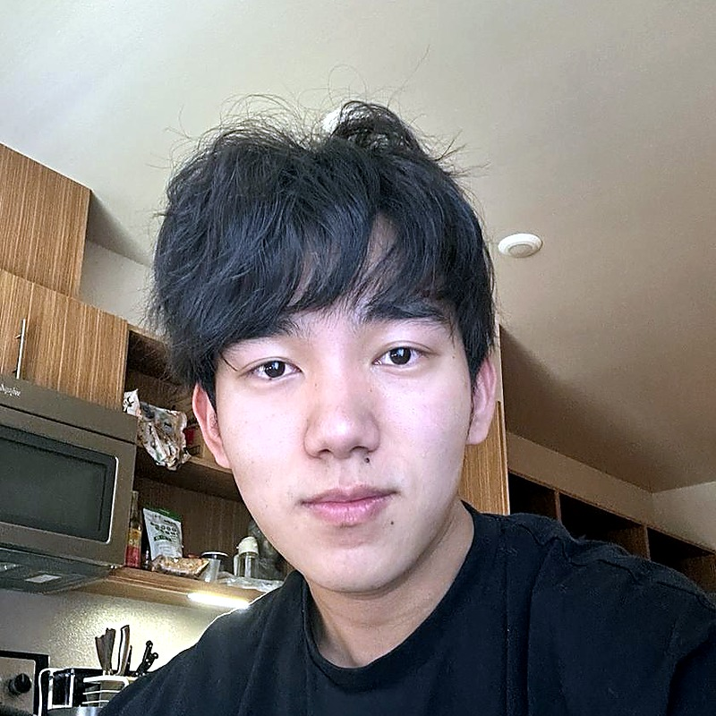

  

    <h1>Weikai Huang</h1>
    
Incoming PhD @ UW CSE RAIVN Lab

    
I am an incoming PhD student at the University of Washington, advised by Prof. <a href="http://www.ranjaykrishna.com/index.html">Ranjay Krishna</a> at <a href="https://raivn.cs.washington.edu/">UW CSE RAIVN Lab</a>. I have also been fortunate to work closely with Prof. <a href="https://jason718.github.io/">Jason Ren</a>, Prof. <a href="https://www.cs.cornell.edu/~bharathh/">Bharath Hariharan</a>, Prof. <a href="https://homes.cs.washington.edu/~ali/">Ali Farhadi</a>, Dr. <a href="https://jieyuz2.github.io/">Jieyu Zhang</a>, and PhD student <a href="https://zixianma.github.io/">Zixian Ma</a>. Previously, I received my undergraduate degree from the University of Washington, where I was a student researcher at <a href="https://allenai.org/">Allen Institute for AI</a>.

    
My research focuses on <strong>developing generalized visual and spatial representations and models</strong> for robotics and embodied agents:

    <ul class="bio research-interests">
      <li><strong>2D/3D/4D vision in the wild</strong>: detection, tracking, reconstruction, and generation (e.g., <em>WildDet3D</em>, <em>SOC</em>, <em>Generate Any Scene</em>).</li>
      <li><strong>Vision-centric policies for robotics</strong> (e.g., <em>MolmoAct2</em>).</li>
      <li><strong>Unified multimodal training and representation learning</strong> (e.g., <em>Molmo2</em>, <em>IPT</em>).</li>
    </ul>
    
<a href="mailto:weikaih@cs.washington.edu">Email</a> / <a href="https://github.com/weikaih04" target="_blank">GitHub</a> / <a href="https://scholar.google.com/citations?user=myeLQPEAAAAJ&hl=en&authuser=1" target="_blank">Google Scholar</a> / <a href="https://twitter.com/weikaih04" target="_blank">X (Twitter)</a> / <a href="/files/weikai_cv.pdf" target="_blank">CV</a>

  

  

    
  

  📢 Always happy to chat with motivated students interested in 3D Vision / Physical AI / Generation / Embodied AI / VLM and Unified Model. Feel free to <a href="mailto:weikaih@cs.washington.edu">reach out</a>!

## News
- **[2026-6]** 2 papers ([IPT](https://arxiv.org/abs/2606.03988) and [Synthetic Visual Genome 2](https://arxiv.org/abs/2602.23543)) accepted to ECCV 2026.
- **[2026-6]** I will be joining Salesforce AI Research as a Research Intern in Palo Alto from June to September 2026.
- **[2026-6]** [Molmo2](https://arxiv.org/abs/2601.10611) received the **CVPR 2026 Compute Transparency Champion** award.
- **[2026-5]** [MolmoAct2](https://allenai.org/blog/molmoact2) released! Action Reasoning Models for real-world robot deployment — see the [paper](https://arxiv.org/pdf/2605.02881), [code](https://github.com/allenai/molmoact2), [models](https://huggingface.co/collections/allenai/molmoact2-finetuned-models), and [data](https://huggingface.co/collections/allenai/molmoact2-bimanualyam-dataset).
- **[2026-4]** [WildDet3D](https://github.com/allenai/WildDet3D) released! Promptable 3D detection in the wild with text, box, and point prompts. Try the [demo](https://huggingface.co/spaces/allenai/WildDet3D) or download the [iPhone app](https://apps.apple.com/us/app/wilddet3d/id6760861157).
- **[2026-4]** [Molmo2](https://arxiv.org/abs/2601.10611) is selected as a **Best Paper Candidate** at CVPR 2026!
- **[2026-2]** 3 papers ([SOC](https://arxiv.org/abs/2510.09110), [Molmo2](https://arxiv.org/abs/2601.10611), [TrajTok](https://arxiv.org/abs/2602.22779)) accepted to CVPR 2026. See you in Denver!
- **[2026-1]** Our work [Generate Any Scene](https://generate-any-scene.github.io/) is accepted to ICLR 2026.
- **[2024-9]** Our work [Task Me Anything](https://www.task-me-anything.org/) is accepted to NeurIPS 2024.
- **[2024-7]** Our work [m&m's](https://arxiv.org/abs/2403.11085) is accepted to ECCV 2024.

## Publications

  (* denotes equal contribution, &hearts; denotes core contributor)
  

    <button id="selectedBtn" class="active">Selected</button>
    <button id="allBtn">All Publications</button>
  

  <!-- Publications will be loaded here dynamically -->

## Industry Experience
-  **Salesforce AI Research** — Research Intern (Incoming), Palo Alto, CA, June–September 2026
-  **Allen Institute for AI (AI2)** — Student Researcher, June 2025–June 2026

## Education
-  **University of Washington** — Ph.D. in Computer Science, 2026–Present (Expected 2031)
-  **University of Washington** — B.S. (with Honors) in Computer Science, 2023–2026

## Awards
- Outstanding Computer Science & Engineering Senior Award, University of Washington — one of three recipients selected from the graduating CSE senior class, 2026
- CVPR 2026 Compute Transparency Champion, Molmo2
- CVPR 2026 Best Paper Candidate, Molmo2
- CVPR 2026 Outstanding Reviewer
- UW CSE John and JoAnne Wisniewski Endowed Scholarship, 2024

## Teaching
- Teaching Assistant:  **University of Washington** — [CSE 455: Computer Vision](https://courses.cs.washington.edu/courses/cse455/), Autumn 2025
- Teaching Assistant:  **University of Washington** — [CSE 493G: Deep Learning](https://courses.cs.washington.edu/courses/cse493g1/26wi/), Winter 2026
- Teaching Assistant:  **University of Washington** — [CSE 493G: Deep Learning](https://courses.cs.washington.edu/courses/cse493g1/25sp/), Spring 2025

## Professional Services
- Workshop Organizer: [Synthetic Data for Computer Vision](https://syndata4cv.github.io/) @ CVPR 2024, 2025 & 2026
- Conference Reviewer: BMVC, NeurIPS/NIPS, CVPR, AAAI

