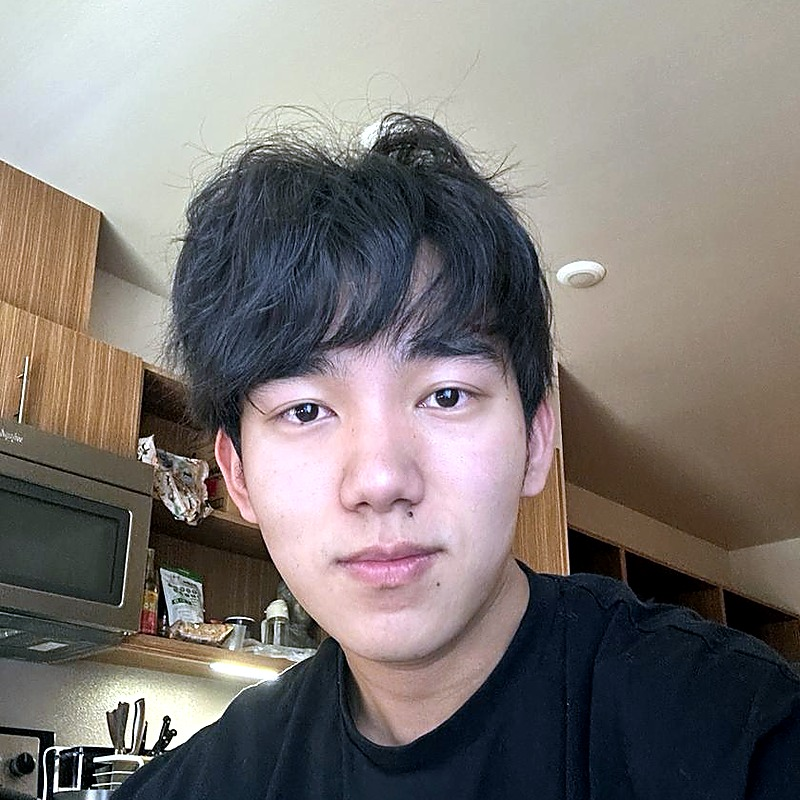

<nav class="site-nav" aria-label="Primary navigation">
  <a class="site-mark" href="/" aria-label="Weikai Huang home">WH</a>
  

    <a href="#research">Research</a>
    <a href="#publications">Publications</a>
    <a href="#experience">Experience</a>
    <a href="/files/weikai_cv.pdf" target="_blank">CV</a>
  

</nav>

  

    
WEIKAI HUANG · INCOMING PH.D. · UW CSE

    <h1>Developing generalized visual representations <em>for robotics.</em></h1>
    
Incoming Ph.D. student at the University of Washington, advised by <a href="http://www.ranjaykrishna.com/index.html">Ranjay Krishna</a> in the <a href="https://raivn.cs.washington.edu/">UW CSE RAIVN Lab</a>.

    
I build systems that connect perception, imagination, and action in open-world environments. Previously, I studied Computer Science at UW and worked as a student researcher at the <a href="https://allenai.org/">Allen Institute for AI</a>, collaborating with researchers across vision, language, and robotics.

    
<a class="link-primary" href="mailto:weikaih@cs.washington.edu">Email</a><a href="https://github.com/weikaih04" target="_blank">GitHub</a><a href="https://scholar.google.com/citations?user=myeLQPEAAAAJ&hl=en&authuser=1" target="_blank">Google Scholar</a><a href="https://twitter.com/weikaih04" target="_blank">X</a><a href="/files/weikai_cv.pdf" target="_blank">CV</a>

  

  

    
    Seattle · UW CSE
  

<section class="research-section" id="research" aria-labelledby="research-title">
  

    

      
Research

      <h2 id="research-title">Perceive, imagine, act.</h2>
    

    
I work across 2D/3D/4D vision, vision-centric policies, and unified multimodal training.

  

  

    <article class="research-card">
      01
      <h3>Vision in the wild</h3>
      
Detection, tracking, reconstruction, and generation for diverse open-world scenes.

      WildDet3D · SOC · Generate Any Scene
    </article>
    <article class="research-card">
      02
      <h3>Visual imagination</h3>
      
Representations that support spatial reasoning, grounding, and multimodal understanding.

      IPT · Molmo2
    </article>
    <article class="research-card">
      03
      <h3>Vision for action</h3>
      
Vision-centric policies that connect perception with reliable robot behavior.

      MolmoAct2
    </article>
  

</section>

  Open to conversations
  I am happy to chat with students interested in 3D vision, physical AI, embodied AI, VLMs, and unified models. <a href="mailto:weikaih@cs.washington.edu">Reach out</a>.

<h2 id="news">News</h2>
- **[2026-6]** 2 papers ([IPT](https://arxiv.org/abs/2606.03988) and [Synthetic Visual Genome 2](https://arxiv.org/abs/2602.23543)) accepted to ECCV 2026.
- **[2026-6]** I will be joining Salesforce AI Research as a Research Intern in Palo Alto from June to September 2026.
- **[2026-6]** [Molmo2](https://arxiv.org/abs/2601.10611) received the **CVPR 2026 Compute Transparency Champion** award.
- **[2026-5]** [MolmoAct2](https://allenai.org/blog/molmoact2) released! Action Reasoning Models for real-world robot deployment — see the [paper](https://arxiv.org/pdf/2605.02881), [code](https://github.com/allenai/molmoact2), [models](https://huggingface.co/collections/allenai/molmoact2-finetuned-models), and [data](https://huggingface.co/collections/allenai/molmoact2-bimanualyam-dataset).
- **[2026-4]** [WildDet3D](https://github.com/allenai/WildDet3D) released! Promptable 3D detection in the wild with text, box, and point prompts. Try the [demo](https://huggingface.co/spaces/allenai/WildDet3D) or download the [iPhone app](https://apps.apple.com/us/app/wilddet3d/id6760861157).
- **[2026-4]** [Molmo2](https://arxiv.org/abs/2601.10611) is selected as a **Best Paper Candidate** at CVPR 2026!
- **[2026-2]** 3 papers ([SOC](https://arxiv.org/abs/2510.09110), [Molmo2](https://arxiv.org/abs/2601.10611), [TrajTok](https://arxiv.org/abs/2602.22779)) accepted to CVPR 2026. See you in Denver!
- **[2026-1]** Our work [Generate Any Scene](https://generate-any-scene.github.io/) is accepted to ICLR 2026.
- **[2024-9]** Our work [Task Me Anything](https://www.task-me-anything.org/) is accepted to NeurIPS 2024.
- **[2024-7]** Our work [m&m's](https://arxiv.org/abs/2403.11085) is accepted to ECCV 2024.

  

    
Selected work

    <h2>Publications</h2>
  

  
A selection of projects spanning perception, multimodal reasoning, and robotics.

  (* denotes equal contribution, &sect; denotes core contributor)
  

    <button id="selectedBtn" class="active">Selected</button>
    <button id="allBtn">All Publications</button>
  

  <!-- Publications will be loaded here dynamically -->

<h2 id="experience">Industry Experience</h2>
-  **Salesforce AI Research** — Research Intern, Palo Alto, CA, June–September 2026
-  **Allen Institute for AI (AI2)** — Student Researcher, June 2025–June 2026

<h2 id="education">Education</h2>
-  **University of Washington** — Ph.D. in Computer Science
-  **University of Washington** — B.S. (with Honors) in Computer Science, 2023–2026

<h2 id="awards">Awards</h2>
- Outstanding Computer Science & Engineering Senior Award, University of Washington — one of three recipients selected from the graduating CSE senior class, 2026
- CVPR 2026 Compute Transparency Champion, Molmo2
- CVPR 2026 Best Paper Candidate, Molmo2
- CVPR 2026 Outstanding Reviewer
- UW CSE John and JoAnne Wisniewski Endowed Scholarship, 2024

<h2 id="teaching">Teaching</h2>
- Teaching Assistant:  **University of Washington** — [CSE 455: Computer Vision](https://courses.cs.washington.edu/courses/cse455/), Autumn 2025
- Teaching Assistant:  **University of Washington** — [CSE 493G: Deep Learning](https://courses.cs.washington.edu/courses/cse493g1/26wi/), Spring 2025; Winter 2026

<h2 id="services">Professional Services</h2>
- Workshop Organizer: [Synthetic Data for Computer Vision](https://syndata4cv.github.io/) @ CVPR 2024, 2025 & 2026
- Conference/Journal Reviewer: IEEE Robotics and Automation Letters (RA-L), BMVC, NeurIPS/NIPS, CVPR, AAAI

